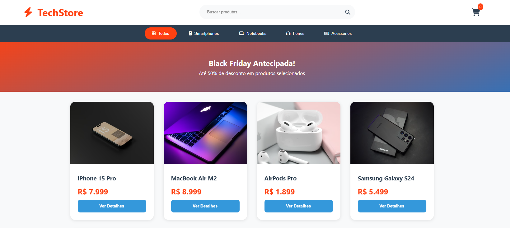

# ⚡ TechStore - Black Friday Antecipada

A **TechStore** é uma plataforma de e-commerce focada em produtos de tecnologia de ponta. Este projeto apresenta uma interface moderna com um banner promocional dinâmico e uma vitrine de produtos premium, desenvolvida para destacar ofertas exclusivas.

> **Status:** Interface Finalizada 🚀

---

## 🚀 Funcionalidades

* **Banner Promocional:** Destaque visual com degradê para campanhas de marketing.
* **Filtros de Navegação:** Menu de categorias rápido (Smartphones, Notebooks, Fones e Acessórios).
* **Vitrine de Produtos:** Cards com design moderno, imagens de alta qualidade e botões "Ver Detalhes".
* **Experiência Visual:** Uso de paleta de cores contrastante para um visual tecnológico.

## 🛠️ Tecnologias Utilizadas

* **HTML5:** Estruturação semântica da loja.
* **CSS3:** Design responsivo, efeitos de hover e estilização de botões.
* **JavaScript:** Gerenciamento de interações e lógica do front-end.

## 📸 Demonstração



## 📂 Estrutura do Projeto

De acordo com a organização do repositório:
* `index.html`: Página principal da loja.
* `style.css`: Estilos globais e componentes visuais.
* `script.js`: Lógica do front-end.
* `img/`: Repositório de imagens e capturas de tela.

## 💻 Como executar

1. Clone este repositório:
   ```bash
   git clone [https://github.com/vinicius311006/NOME-DO-SEU-REPOSITORIO.git](https://github.com/vinicius311006/NOME-DO-SEU-REPOSITORIO.git)
